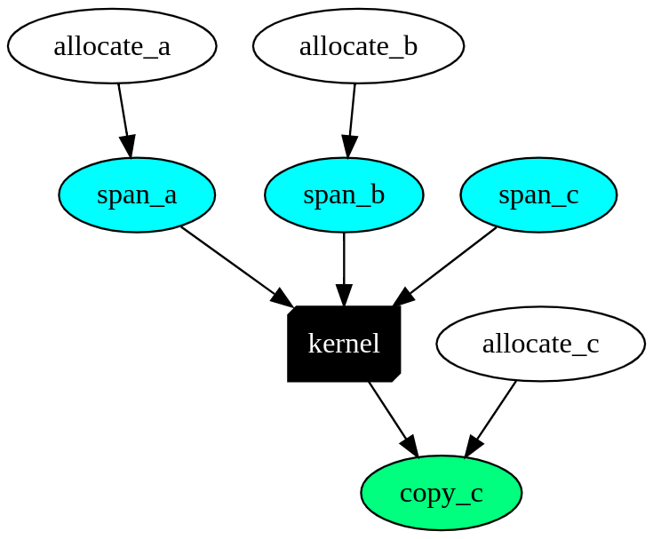

# Heteroflow 

A header-only C++ library to help you quickly write
concurrent CPU-GPU programs using task models

# Why Heteroflow?

Parallel CPU-GPU programming is never an easy job 
due to difficult concurrency details.
Heteroflow helps you deal with this challenge through a new programming model
using modern C++ and [Nvidia CUDA Toolkit][cuda-toolkit].

# Table of Contents

* [Write Your First Heteroflow Program](#write-your-first-heteroflow-program)
* [Create a Heteroflow Application](#create-a-heteroflow-application)
   * [Step 1: Create a Heteroflow Graph](#step-1-create-a-heteroflow-graph)
   * [Step 2: Define Task Dependencies](#step-2-define-task-dependencies)
   * [Step 3: Execute a Heteroflow](#step-3-execute-a-heteroflow)
* [Visualize a Heteroflow Graph](#visualize-a-heteroflow-graph)
* [Compile Unit Tests and Examples](#compile-unit-tests-and-examples)
* [System Requirements](#system-requirements)
* [Get Involved](#get-involved)

# Write Your First Heteroflow Program

The following example [saxpy.cu](./examples/saxpy.cu) implements
the canonical single-precision A·X Plus Y ("saxpy") operation.


```cpp
#include <heteroflow/heteroflow.hpp>  // Heteroflow is header-only

__global__ void saxpy(int n, float a, float *x, float *y) {
  int i = blockIdx.x*blockDim.x + threadIdx.x;
  if (i < n) y[i] = a*x[i] + y[i];
}

int main(void) {

  const int items = 1<<20;                // total items
  const int bytes = items*sizeof(float);  // total bytes
  float* x {nullptr};
  float* y {nullptr};

  hf::Executor executor;                  // create an executor
  hf::Heteroflow hf("saxpy");             // create a task dependency graph 
  
  auto host_x = hf.host([&]{ x = create_vector(N, 1.0f); });
  auto host_y = hf.host([&]{ y = create_vector(N, 2.0f); }); 
  auto span_x = hf.span(std::ref(x), B);
  auto span_y = hf.span(std::ref(y), B);
  auto kernel = hf.kernel((N+255)/256, 256, 0, saxpy, N, 2.0f, span_x, span_y);
  auto copy_x = hf.copy(std::ref(x), span_x, B);
  auto copy_y = hf.copy(std::ref(y), span_y, B);
  auto verify = hf.host([&]{ verify_result(x, y, N); });
  auto kill_x = hf.host([&]{ delete_vector(x); });
  auto kill_y = hf.host([&]{ delete_vector(y); });

  host_x.precede(span_x);                 // host tasks run before span tasks
  host_y.precede(span_y);
  kernel.precede(copy_x, copy_y)          // kernel runs before/after copy/span tasks
        .succeed(span_x, span_y); 
  verify.precede(kill_x, kill_y)          // verifier runs before/after kill/copy tasks
        .succeed(copy_x, copy_y); 

  executor.run(hf).wait();                // execute the task dependency graph
}
```

The saxpy task dependency graph is shown in the following figure:


Compile and run the code with the following commands:

```bash
~$ nvcc saxpy.cu -std=c++14 -O2 -o saxpy -I path/to/Heteroflow/header
~$ ./saxpy
```

Heteroflow is header-only. Simply copy the entire folder 
[heteroflow/](heteroflow/) to your project and add the include path accordingly.


# Create a Heteroflow Application

Heteroflow manages concurrent CPU-GPU programming 
using a *task dependency graph* model.
Each node in the graph represents either a CPU (host) task 
or a GPU (device) task.
Each edge indicates
a dependency constraint between two tasks.
Most applications are developed through the following steps:

## Step 1: Create a Heteroflow Graph

Create a heteroflow object to build a task dependency graph:

```cpp
hf::Heteroflow hf;
hf.name("MyHeteroflow");  // assigns a name to the heteroflow object
```

Each task belongs to one of the following categories: 
*host*, *span*, *fill*, *copy*, and *kernel*.


### Task Type #1: Host Task

A host task is a callable for which [std::invoke][std::invoke] is applicable
on any CPU core.

```cpp
hf::HostTask host = heteroflow.host([](){ std::cout << "my host task\n"; });
```

### Task Type #2: Span Task

A span task allocates memory on a GPU device. 
The following example creates a span task that allocates
256 bytes of an uninitialized storage on a GPU device.

```cpp
hf::SpanTask span = hf.span(256);
```

Alternatively, you can create a span task to allocate an initialized storage
from a host memory area.
The code blow creates a span task that allocates a device memory block
with size and value equal to the data in `vec`.


```cpp
std::vector<int> vec(256, 0);
hf::SpanTask span = hf.span(vec.data(), 256*sizeof(int));
```

Heteroflow performs GPU memory operations through *span* tasks
rather than raw pointers.
This layer of abstraction allows users to focus on building
efficient task graphs with transparent scalability to manycore CPUs 
and multiple GPUs.

 
### Task Type #3: Fill Task

A fill task sets GPU memory managed by a span task to a value.
The following code example creates fill tasks that sets each byte
to zero in the specified range of a GPU memory block managed by a span task.

```cpp
// sets each byte in [0, 1024) of span to 0
hf::FillTask fill1 = hf.fill(span, 1024, 0);      

// sets each byte in [1000, 1020) of span to 0
hf::FillTask fill2 = hf.fill(span, 1000, 20, 0);  
```

### Task Type #4: Copy Task

A copy task performs data transfers in one of the three directions,
*host to device* (H2D), *device to device* (D2D), and *device to host* (D2H).
The following example creates copy tasks that transfer
data from the host memory area to a GPU memory block managed by a span task.

```cpp
std::string str("H2D data transfers");

// copies the entire string to the span
hf::CopyTask h2d1 = hf.copy(span, str.data(), str.size());  

// copies [10, 13) bytes (characters) from span to the host string
hf::CopyTask h2d2 = hf.copy(span, 10, str.data(), 3);       
```

The following example creates copy tasks that transfer
data from a GPU memory block managed by a span task to a host memory area.

```cpp
std::string str("D2H data transfers");

// copies 10 bytes from span to the host string
hf::CopyTask d2h1 = hf.copy(str.data(), span, 10);

// copies 10 bytes from [5, 15) of span to the host string
hf::CopyTask d2h2 = hf.copy(str.data(), span, 5, 10);
```

The following example creates copy tasks that transfer data between
two GPU memory blocks managed by two span tasks.

```cpp
// copies 100 bytes from src_span to tgt_span
hf::CopyTask d2d1 = copy(tgt_span, src_span, 100);

// copies 100 bytes from [5, 105) of src_span to tgt_span
hf::CopyTask d2d2 = copy(tgt_span, src_span, 5, 100);

// copies 100 bytes from src_span to [10, 110) of tgt_span
hf::CopyTask d2d3 = copy(tgt_span, 10, src_span, 100);

// copies 100 bytes from [10, 110) of src_span to [20, 120) of tgt_span
hf::CopyTask d2d4 = copy(tgt_span, 20, src_span, 10, 100);
```


### Task Type #5: Kernel Task

A kernel task offloads a kernel function to a GPU device.
Heteroflow abstracts GPU memory through span tasks 
to facilitate the design of task scheduling with automatic GPU device mapping.
Each span task manages a GPU memory pointer that
will implicitly convert to the pointer type 
of the corresponding entry in binding a kernel task to a kernel function.
The example below demonstrates the creation of a kernel task.

```cpp
// GPU kernel to set each entry of an integer array to a given value
__global__ void gpu_set(int* data, size_t N, int value) {
  int i = blockIdx.x*blockDim.x + threadIdx.x;
  if (i < N) {
    data[i] = value;
  }
}

// creates a span task to allocates a raw storage of 65536 integers
hf::SpanTask span = hf.span(65536*sizeof(int));

// kernel execution configuration
dim3 grid  {(65536+256-1)/256, 1, 1};
dim3 block {256, 1, 1};
size_t Ns  {0};

// creates a kernel task to offload gpu_set to a GPU device
hf::KernelTask k1 = hf.kernel(
  grid,           // dimension of the grid
  block,          // dimension of the block
  shared_memory,  // number of bytes in shared memory
  gpu_set,        // kernel function to offload
  span,           // 1st argument to pass to the kernel function
  65536,          // 2nd argument to pass to the kernel function
  1               // 3rd argument to pass to the kernel function
); 
```

Heteroflow gives users full privileges to 
craft a [CUDA][cuda-zone] kernel 
that is commensurate with their domain knowledge.
Users focus on developing high-performance kernel tasks using 
the native CUDA programming toolkit,
while leaving task parallelism to Heteroflow.

### Access/Modify Task Attributes

You can query or modify the attributes of a task directly
from its handle.

```cpp
// names a task and queries the task name
task.name("my task");
std::cout << task.name();

// queries if a task is empty
std::cout << "task is empty? " << (task.empty() ? "yes" : "no");

// queries the in/out degree of a task
std::cout << task.num_successors() << '/' << task.num_dependents();
```

## Step 2: Define Task Dependencies

You can add dependency links between tasks to enforce one task to run after another.
The dependency links must be a
[Directed Acyclic Graph (DAG)](https://en.wikipedia.org/wiki/Directed_acyclic_graph).
You can add a preceding link to force one task to run before another.

```cpp
A.precede(B);        // A runs before B
A.precede(C, D, E);  // A runs before C, D, and E
```

Or you can add a succeed link to force one task to run after another.

```cpp
A.succeed(B);        // A runs after B
A.succeed(C, D, E);  // A runs after C, D, and E
```

## Step 3: Execute a Heteroflow

To execute a heteroflow, you need to create an *executor*.
An executor manages a set of worker threads to execute a heteroflow
and perform automatic computation offloading to GPUs
through an efficient *work-stealing* algorithm.

```cpp
tf::Executor executor;
```

You can configure an executor with a fixed number threads to
operate on CPU cores and GPUs.

```cpp
tf::Executor executor(32, 4);  // 32 CPU cores and 4 GPUs
```

The executor provides many methods to run a heteroflow.
You can run a heteroflow one time, multiple times, or 
based on a stopping criteria.
These methods are *non-blocking* with a [std::future][std::future] return
to let you query the execution status.
All executor methods are *thread-safe*.

```cpp
std::future<void> r1 = executor.run(heteroflow);       // run the heteroflow once
std::future<void> r2 = executor.run_n(heteroflow, 2);  // run the heteroflow twice

// keep running until the predicate becomes true (4 times in this example)
executor.run_until(taskflow, [counter=4](){ return --counter == 0; } );
```

You can call `wait_for_all` to block the executor until all associated taskflows complete.

```cpp
executor.wait_for_all();  // blocks until all associated tasks finish
```

Notice that executor does not own any heteroflow. 
It is your responsibility to keep a heteroflow alive during its execution,
or it can result in undefined behavior.
In most applications, you need only one executor to run multiple heteroflows
each representing a specific part of your parallel decomposition.

## Stateful Execution

When you create a task, the heteroflow object marshals all arguments
along with a unique task execution function to form a 
*stateful closure* using C++ lambda and reference wrapper [std::ref][std::ref].
Any changes on referenced variables will be visible to the execution
context of the task.
Stateful execution enables *flexible runtime controls*
and *fine-grained* task parallelism.
Users can partition a large workload into small parallel blocks and append
dependencies between tasks to keep variable states consistent.
Below the code snippet demonstrates this concept.

```cpp
__global my_kernel(int* ptr, size_t N);  // custom kernel

int* data {nullptr};
size_t size{0};
dim3 grid;

auto host = heteroflow.host([&] () {     // captures everything by reference
  data = new float[1000];                // changes data and size at runtime
  size = 1000*sizeof(int);
  grid = (1000+256-1)/256;               // changes the kernel execution shape
});

// new data and size values are visible to this pull task's execution context
auto span = heteroflow.span(std::ref(data), std::ref(size))
                      .succeed(host);

// new grid size is visible to this kernel task's execution context
auto kernel = heteroflow.kernel(std::ref(grid), 256, 0, my_kernel, span, 1000)
                        .succeed(span);
```

All the arguments, except `SpanTask`, 
forwarded to each task construction method
can be made stateful using [std::ref][std::ref].


# Visualize a Heteroflow Graph

Visualization is a great way to inspect a task graph
for refinement or debugging purpose.
You can dump a heteroflow graph to a [DOT format][dot-format]
and visualize it through free [GraphViz][GraphViz] tools.

```cpp
hf::Heteroflow hf;

auto ha = hf.host([](){}).name("allocate_a");
auto hb = hf.host([](){}).name("allocate_b");
auto hc = hf.host([](){}).name("allocate_c");
auto sa = hf.span(1024).name("span_a");
auto sb = hf.span(1024).name("span_b");
auto sc = hf.span(1024).name("span_c");
auto op = hf.kernel({(1024+32-1)/32}, 32, 0, fn_kernel, sa, sb, sc).name("kernel");
auto cc = hf.copy(host_data, sc, 1024).name("copy_c");
  
ha.precede(sa);
hb.precede(sb);
op.succeed(sa, sb, sc).precede(cc);
cc.succeed(hc);

hf.dump(std::cout);  // dump the graph to a DOT format through standard output
```

The program generates the following graph drawn by 
[Graphviz Online](https://dreampuf.github.io/GraphvizOnline/):



```bash
digraph p0x7ffc17d62b40 {
  rankdir="TB";
  p0x510[label="allocate_a"];
  p0x510 -> p0xdc0;
  p0xc10[label="allocate_b"];
  p0xc10 -> p0xe90;
  p0xcf0[label="allocate_c"];
  p0xcf0 -> p0x100;
  p0xdc0[label="span_a"];
  p0xdc0 -> p0x030;
  p0xe90[label="span_b"];
  p0xe90 -> p0x030;
  p0xf60[label="span_c"];
  p0xf60 -> p0x030;
  p0x030[label="kernel"];
  p0x030 -> p0x100;
  p0x100[label="copy_c"];
}
```


# Compile Unit Tests and Examples

Heteroflow uses [CMake](https://cmake.org/) to build examples and unit tests.
We recommend out-of-source build.

```bash
~$ cmake --version  # must be at least 3.9 or higher
~$ mkdir build
~$ cd build
~$ cmake ../
~$ make 
```

## Unit Tests

We use CMake's testing framework to run all unit tests.

```bash
~$ make test
```

## Examples

The folder [examples/](./examples) contains a number of practical CPU-GPU applications and is a great place to learn to use Heteroflow.

| Example |  Description |
| ------- |  ----------- | 
| [saxpy.cu](./examples/saxpy.cu) | implements a saxpy (single-precision A·X Plus Y) task graph |
| [matrix-multiplication.cu](./examples/matrix-multiplication.cu)| implements two matrix multiplication task graphs, with and without GPU |

# System Requirements

To use Heteroflow, you need a [Nvidia's CUDA Compiler (NVCC)][nvcc] 
of version at least 9.0 to support C++14 standards.

# Get Involved

+ Report bugs/issues by submitting a [GitHub issue][GitHub issues]
+ Submit contributions using [pull requests][GitHub pull requests]
+ Visit a curated list of [awesome parallel computing resources](https://github.com/tsung-wei-huang/awesome-parallel-computing)

# License

Heteroflow is licensed under the [MIT License](./LICENSE).

* * *

[std::ref]:              https://en.cppreference.com/w/cpp/utility/functional/ref
[span::data]:            https://en.cppreference.com/w/cpp/container/span/data
[std::invoke]:           https://en.cppreference.com/w/cpp/utility/functional/invoke
[std::future]:           https://en.cppreference.com/w/cpp/thread/future
[cuda-zone]:             https://developer.nvidia.com/cuda-zone
[nvcc]:                  https://developer.nvidia.com/cuda-llvm-compiler
[cuda-toolkit]:          https://developer.nvidia.com/cuda-toolkit

[GitHub issues]:         https://github.com/heteroflow/heteroflow/issues
[GitHub insights]:       https://github.com/heteroflow/heteroflow/pulse
[GitHub pull requests]:  https://github.com/heteroflow/heteroflow/pulls

[dot-format]:            https://en.wikipedia.org/wiki/DOT_(graph_description_language)
[GraphViz]:              https://www.graphviz.org/
