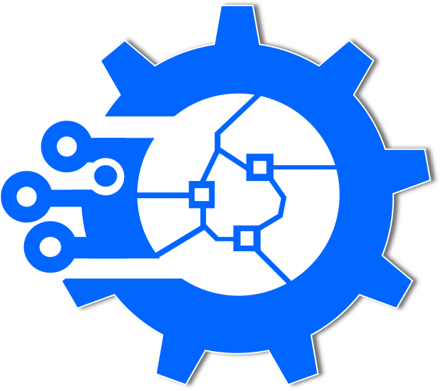
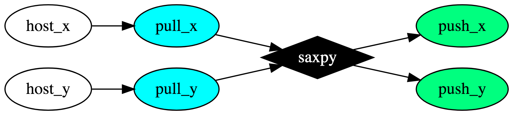

# Heteroflow 

A header-only C++ library to help you quickly write
concurrent CPU-GPU programs using task models

:exclamation: This is a working repository with many things under construction,
but with enough information to highlight the spirit of Heteroflow.

# Why Heteroflow?

Modern high-performance computing leverages a heterogeneous mix of 
both CPU and GPU devices.
However, concurrent CPU-GPU programming is notoriously difficult
due to many implementation details.
Heteroflow helps you deal with this challenge through a new programming model
using modern C++ and Nvidia CUDA Toolkit.

# Write your First Heteroflow Program

The following example [saxpy.cu](./examples/saxpy.cu) implements
the canonical single-precision A·X Plus Y ("saxpy") operation.


```cpp
#include <heteroflow/heteroflow.hpp>  // Heteroflow is header-only

__global__ void saxpy(int n, float a, float *x, float *y) {
  int i = blockIdx.x*blockDim.x + threadIdx.x;
  if (i < n) y[i] = a*x[i] + y[i];
}

int main(void) {

  const int items = 1<<20;                // total items
  const int bytes = items*sizeof(float);  // total bytes
  float* x {nullptr};
  float* y {nullptr};

  hf::Executor executor;                  // create an executor
  hf::Heteroflow hf("saxpy");             // create a task dependency graph 
  
  auto host_x = hf.host([&]{ x = create_vector(N, 1.0f); });
  auto host_y = hf.host([&]{ y = create_vector(N, 2.0f); }); 
  auto pull_x = hf.pull(std::ref(x), B);
  auto pull_y = hf.pull(std::ref(y), B);
  auto kernel = hf.kernel((N+255)/256, 256, 0, saxpy, N, 2.0f, pull_x, pull_y);
  auto push_x = hf.push(std::ref(x), pull_x, B);
  auto push_y = hf.push(std::ref(y), pull_y, B);
  auto verify = hf.host([&]{ verify_result(x, y, N); });
  auto kill_x = hf.host([&]{ delete_vector(x); });
  auto kill_y = hf.host([&]{ delete_vector(y); });

  host_x.precede(pull_x);                 // host tasks run before pull tasks
  host_y.precede(pull_y);
  kernel.precede(push_x, push_y)          // kernel runs before/after push/pull tasks
        .succeed(pull_x, pull_y); 
  verify.precede(kill_x, kill_y)          // verifier runs before/after kill/push tasks
        .succeed(push_x, push_y); 

  executor.run(hf).wait();                // execute the task dependency graph
}
```

The saxpy task dependency graph is shown in the following figure:




Compile and run the code with the following commands:

```bash
~$ nvcc saxpy.cu -std=c++14 -O2 -o saxpy -I path/to/Heteroflow/header
~$ ./saxpy
```

# Create a Heteroflow Application

Heteroflow manages concurrent CPU-GPU programming 
using a *task dependency graph* model.
Each node in the graph represents a task and each edge indicates
a dependency constraint between two nodes.
Most applications are developed through the following steps:

## Step 1: Create a Heteroflow Graph

Create a heteroflow object to build a task dependency graph:

```cpp
hf::Heteroflow heteroflow;
```

Each task belongs to one of the following categories: 
*host*, *pull*, *push*, *kernel*, and *transfer*.


### Host Task

A host task is a callable for which [std::invoke][std::invoke] is applicable
on any CPU core.

```cpp
hf::HostTask host = heteroflow.host([](){ std::cout << "my host task\n"; });
```

### Pull Task

A pull task allocates memory on a GPU and copies
data from the host to the GPU.

```cpp
float* data = new float[10];
hf::PullTask pull = heteroflow.pull(data, 10*sizeof(float));
```

If the data pointer is given a `nullptr`, 
the pull task only allocates a GPU memory area of the given bytes.
In this case, you can give an additional value to initialize 
for each byte of the memory.

```cpp
hf::PullTask gpu_mem1 = heteroflow.pull(nullptr, 256);
hf::PullTask gpu_mem2 = heteroflow.pull(nullptr, 256, 0); 
```
 
### Push Task

A push task copies GPU data in a pull task back to a host memory area.

```cpp
hf::PushTask push = heteroflow.push(data, pull, 10*sizeof(float));
```

You can give an *offset* in bytes to indicate the starting point
of the push operation.
The code snippet below skips the first three floats and
copies the remaining seven floats from a memory block of a pull task
to a host memory area pointed by data.

```cpp
hf::PushTask push = heteroflow.push(data, pull, 3*sizeof(float), 7*sizeof(float))
```

### Kernel Task

A kernel task offloads a kernel function to a GPU device.
Heteroflow abstracts GPU memory through pull tasks 
to perform automatic device mapping and memory allocation at runtime.
Each pull task will implicitly convert to the pointer type in the corresponding
argument entry of the kernel function.

```cpp
__global__ void my_kernel(float* data, int N);

dim3 grid {1, 1, 1}, block {10, 1, 1};
size_t shared_memory {0};

// implicit coversion of pull to float*
hf::KernelTask k1 = hf.kernel(grid, block, shared_memory, my_kernel, pull, 10); 
```

Heteroflow gives users full privileges to 
craft a [CUDA][cuda-zone] kernel 
that is commensurate with their domain knowledge.
Users focus on developing high-performance kernels and 
CPU tasks using native CUDA toolkits,
while leaving task parallelism to Heteroflow.

### Transfer Task

A transfer task copies GPU data from a source pull task to a target pull task.
The code snippet blow copies data from `[ptr2+56, ptr2+256)` 
to `[ptr1+10, ptr1+210)`, assuming `ptr1` and `ptr2` point to the beginning
address of the GPU memory in `pull1` and `pull2`, respectively.

```cpp
hf::PullTask pull1 = heteroflow.pull(nullptr, 256, 'a');
hf::PullTask pull2 = heteroflow.pull(nullptr, 256, 'b'); 

hf::TransferTask transfer = hteroflow.transfer(
  pull1,    // destination pull task
  10,       // offset at the destination memory block
  pull2,    // source pull task
  56,       // offset at the source memory block
  200       // bytes to copy from the source to the destination
);
```

## Step 2: Define Task Dependencies

You can add dependency links between tasks to enforce one task to run after another.
The dependency links must be a
[Directed Acyclic Graph (DAG)](https://en.wikipedia.org/wiki/Directed_acyclic_graph).
You can add a preceding link to force one task to run before another.

```cpp
A.precede(B);        // A runs before B
A.precede(C, D, E);  // A runs before C, D, and E
```

Or you can add a succeed link to force one task to run after another.

```cpp
A.succeed(B);        // A runs after B
A.succeed(C, D, E);  // A runs after C, D, and E
```

## Step 3: Execute a Heteroflow

To execute a heteroflow, you need to create an *executor*.
An executor manages a set of worker threads to execute a heteroflow
and perform automatic computation offloading to GPUs
through an efficient *work-stealing* algorithm.

```cpp
tf::Executor executor;
```

You can configure an executor with a fixed number threads to
operate on CPU cores and GPUs.

```cpp
tf::Executor executor(32, 4);  // 32 CPU cores and 4 GPUs
```

The executor provides many methods to run a heteroflow.
You can run a heteroflow one time, multiple times, or 
based on a stopping criteria.
These methods are *non-blocking* with a [std::future][std::future] return
to let you query the execution status.
All executor methods are *thread-safe*.

```cpp
std::future<void> r1 = executor.run(heteroflow);       // run the heteroflow once
std::future<void> r2 = executor.run_n(heteroflow, 2);  // run the heteroflow twice

// keep running until the predicate becomes true (4 times in this example)
executor.run_until(taskflow, [counter=4](){ return --counter == 0; } );
```

You can call `wait_for_all` to block the executor until all associated taskflows complete.

```cpp
executor.wait_for_all();  // blocks until all associated tasks finish
```

Notice that executor does not own any heteroflow. 
It is your responsibility to keep a heteroflow alive during its execution,
or it can result in undefined behavior.
In most applications, you need only one executor to run multiple heteroflows
each representing a specific part of your parallel decomposition.

## Stateful Execution

Heteroflow allows users to capture variables in reference through [std::ref][std::ref]
for *stateful* execution,
enabling flexible runtime controls and fine-grained task parallelism.
Users can partition a large workload into small parallel blocks and append
dependencies between tasks to keep variable states consistent.
Below the code snippet demonstrates this concept.

```cpp
__global my_kernel(PullTask, size_t N);  // custom kernel

float* data{nullptr};
size_t size{0};
dim3 grid;

auto host = heteroflow.host([&](){       // captures everything by reference
  data = new float[1000];                // changes size and data at runtime
  size = 1000*sizeof(float);
  grid = (1000+255)/256;                 // changes the kernel execution shape
});

// new data and size values are visible to this pull task's execution context
auto pull = heteroflow.pull(std::ref(data), std::ref(size))
                      .succeed(host);

// new grid size is visible to this kernel tasks' execution context
auto kernel = heteroflow.kernel(std::ref(grid), 256, 0, my_kernel, pull, 1000)
                        .succeed(pull);
```

The variables to forward to other tasks can be made stateful
in a similar fashion.


# System Requirements

To use Heteroflow, you need a [Nvidia's CUDA Compiler (NVCC)][nvcc] 
of version at least 9.0 to support C++14 standards.

# License

Heteroflow is licensed under the [MIT License](./LICENSE).

* * *

[std::ref]:              https://en.cppreference.com/w/cpp/utility/functional/ref
[span::data]:            https://en.cppreference.com/w/cpp/container/span/data
[std::invoke]:           https://en.cppreference.com/w/cpp/utility/functional/invoke
[std::future]:           https://en.cppreference.com/w/cpp/thread/future
[cuda-zone]:             https://developer.nvidia.com/cuda-zone
[nvcc]:                  https://developer.nvidia.com/cuda-llvm-compiler

